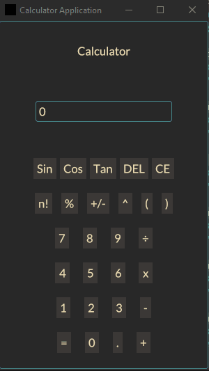
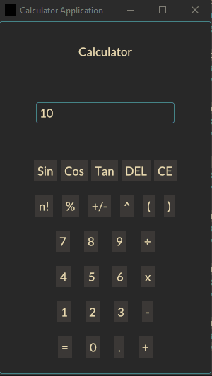
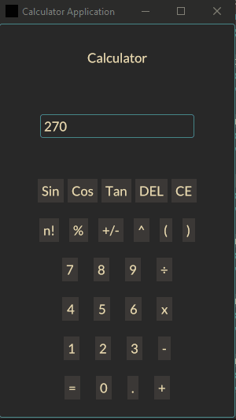
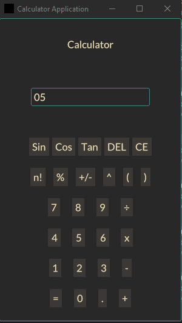
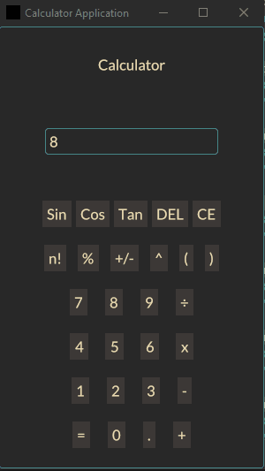
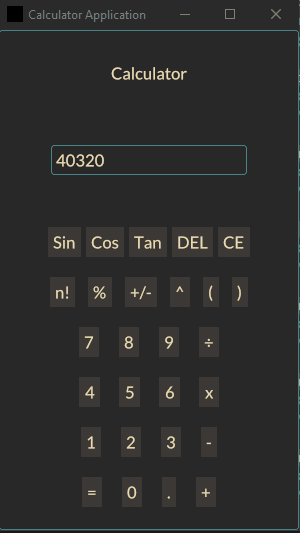

# Basic Calculator built using Rust(iced)
- https://github.com/ShehanAT/basic-calculator-rust

- [(230108) How to use custom themes for Iced GUI library | Rust Programming Tutorial | Coding Informer](https://youtu.be/Bl02RY3FXJU?si=A8mBQEE_D8JrvZEx)

- ㄷㅏ른거 살려보자
  - https://github.com/Leak9867/simple-calculator

<hr />


## A Simple Calculator Built with Iced GUI Library and Rust

Here is a simple calculator built with the [Iced GUI Library](https://github.com/iced-rs/iced) and [Rust](https://github.com/rust-lang/rust)!

#### Screenshots:



_Figure 1: Addition operation_



_Figure 2: Multiplication operation_



_Figure 3: Division operation_



_Figure 4: Sin operation_



_Figure 5: Factorial operation_



_Figure 6: DEL and CE operation_
# Result

```bash

```

